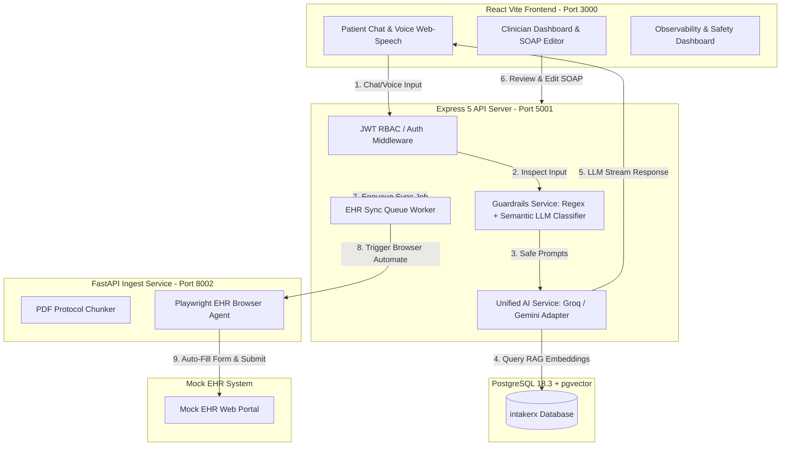

# IntakeRx: AI Voice + Chat Patient Intake & Pre-Screening System

IntakeRx is a healthcare-domain AI system designed to automate and secure the patient intake and clinical pre-screening process. The system enables patients to complete their intake via web-chat or real-time voice, uses Retrieval-Augmented Generation (RAG) to query clinical protocols for appropriate triage questions, flags urgent symptoms for immediate clinician review, and automatically inserts structured summaries into simulated Electronic Health Records (EHR) via browser automation.

Built with an emphasis on **AI safety, security hardening, and prompt injection defense**, IntakeRx features advanced guardrails to prevent diagnostic liability and adversarial bypass attempts.

---

## 🚀 Key Features

* **Dual-Mode Patient Intake**: Interactive, real-time streaming chat or browser-native Web Speech voice modes.
* **Clinical Protocol RAG**: Automatically parses and queries medical guidelines (e.g., Cardiac Chest Pain, Asthma, GI Pain) using high-speed vector embeddings in PostgreSQL.
* **Dual-Layer Guardrail System**: 
  * *Input Guardrail*: A combination of regex heuristics and a semantic classifier that blocks jailbreaks and instructions overrides.
  * *Output Guardrail*: Actively filters generated text to block diagnostic language, routing recommendations, and medical advice.
* **Clinician Review Portal**: A dashboard for healthcare providers to review patient histories, highlight safety flags, edit SOAP summaries with visual text diffing, and trigger EHR syncs.
* **EHR Integration Engine**: Headless browser automation (Playwright) that securely injects finalized SOAP summaries into a mock EHR form portal.
* **Real-time Observability**: Cost metrics, safety event audits, and Time-to-First-Token (TTFT) performance stats.

---

## 📐 System Architecture

The following diagram illustrates how data flows between the patient client, Express backend, FastAPI RAG service, database, and EHR portal:



---

## 🛠️ Tech Stack

* **Frontend**: React (TypeScript), Vite, Vanilla CSS (Premium Glassmorphism Dark Mode), Web Speech API.
* **Backend**: Express 5 (TypeScript), Node.js, Nodemon, WebSocket.
* **AI & Embedding Engine**: Groq (`llama-3.3-70b-versatile` for sub-second streaming inference), Google Gemini (`gemini-embedding-001` for vector embedding generation).
* **AI Safety Layer**: Semantic LLM Classifier + Regex Input Sanitizer, Rule-based Output Filters, and Emergency Red-Flag Triage Router.
* **RAG & Database**: PostgreSQL 18.3, `pgvector` extension, HNSW Vector Indexing.
* **Python Services**: FastAPI, Playwright (headless browser automation), PyPDF.

---

## 📦 Project Structure

```
intakerx/
├── backend/          # Express 5 API server, guardrails, DB schemas, and evaluation scripts
├── fastapi/          # Python FastAPI service, PDF ingestion, and Playwright EHR automation
├── frontend/         # React SPA frontend (Patient chat interface & clinician portal)
├── .env.example      # Environment variables configuration template
├── .gitignore        # Git ignore rules for node_modules, envs, and py envs
└── SECURITY_GUIDELINES.md  # Core repository security rules
```

---

## ⚙️ Installation & Setup

### Prerequisites
* [PostgreSQL](https://www.postgresql.org/) (Version 15+ recommended, includes `vector` extension).
* [Node.js](https://nodejs.org/) (v18+).
* [Python](https://www.python.org/) (v3.10+).

---

### Step 1: Database Setup
1. Open PostgreSQL and create the database:
   ```sql
   CREATE DATABASE intakerx;
   ```
2. Enable the `vector` extension on the database:
   ```sql
   \c intakerx
   CREATE EXTENSION IF NOT EXISTS vector;
   ```

---

### Step 2: Backend Setup
1. Navigate to the backend directory:
   ```bash
   cd backend
   ```
2. Install dependencies:
   ```bash
   npm install
   ```
3. Create a `.env` file from the example:
   ```bash
   cp ../.env.example .env
   ```
   Configure your `DATABASE_URL`, `GEMINI_API_KEY`, and `GROQ_API_KEY` inside the `.env` file.
4. Run the database migration and seeder:
   ```bash
   npm run db:init
   ```
5. Start the backend development server (Port 5001):
   ```bash
   npm run dev
   ```

---

### Step 3: FastAPI Python Service Setup
1. Navigate to the fastapi directory:
   ```bash
   cd ../fastapi
   ```
2. Create and activate a virtual environment:
   ```bash
   python -m venv venv
   # On Windows:
   .\venv\Scripts\activate
   # On macOS/Linux:
   source venv/bin/activate
   ```
3. Install dependencies:
   ```bash
   pip install -r requirements.txt
   ```
4. Install Playwright browser engines:
   ```bash
   playwright install chromium
   ```
5. Bootstrap default medical protocols (this chunks, embeds, and uploads default Cardiac, Asthma, and GI protocols to PostgreSQL):
   ```bash
   # Run the server on Port 8002
   uvicorn app.main:app --host 127.0.0.1 --port 8002
   ```
6. Trigger protocol ingestion (in a separate terminal or via API client):
   * Send a `POST` request to `http://localhost:8002/api/protocols/bootstrap` to ingest the gold-standard protocol documents.

---

### Step 4: Frontend Setup
1. Navigate to the frontend directory:
   ```bash
   cd ../frontend
   ```
2. Install dependencies:
   ```bash
   npm install
   ```
3. Start the Vite development server (Port 3000):
   ```bash
   npm run dev
   ```
4. Access the web application at [http://localhost:3000](http://localhost:3000).

---

## 🧪 Evaluation Gates

IntakeRx features automated evaluations that verify system safety and triage accuracy:

### 1. Adversarial Safety Evaluation (`npm run eval:safety`)
* **Test suite location**: `backend/src/eval/adversarial_eval.ts`
* **Coverage**: Runs 30 test cases (15 benign patient statements and 15 complex adversarial prompts, such as system overrides, prompt escapes, and out-of-scope requests).
* **Performance Gate**: Must achieve $\ge 95\%$ injection block rates. (IntakeRx currently achieves **100% block rate**).
* **Command to run**:
  ```bash
  cd backend
  npm run eval:safety
  ```

### 2. Triage Accuracy Evaluation (`npm run eval:triage`)
* **Test suite location**: `backend/src/eval/triage_eval.ts`
* **Coverage**: Runs 15 detailed patient symptom reports. Matches the AI output classification (`emergency`, `urgent`, `routine`) against clinical gold-standards.
* **Performance Gate**: Must achieve $\ge 90\%$ classification accuracy with **0 missed emergency cases**. (IntakeRx currently achieves **93.3% accuracy**).
* **Command to run**:
  ```bash
  cd backend
  npm run eval:triage
  ```

---

## 🔒 Security Hardening Policies
Please review the [SECURITY_GUIDELINES.md](SECURITY_GUIDELINES.md) file for comprehensive rules regarding the configuration of environment files and local settings. Never commit active keys, password strings, or local testing configurations to GitHub.
